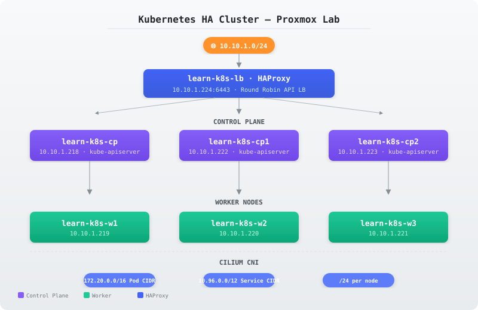
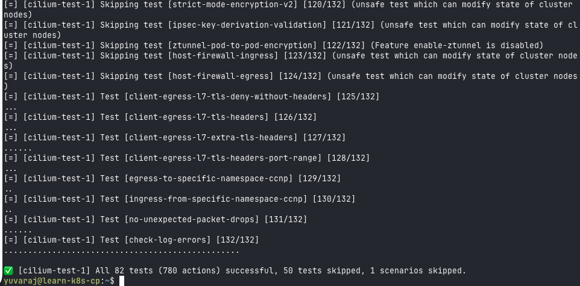

# kubernetes-ha-proxmox-lab

[](https://kubernetes.io)
[](https://cilium.io)
[](https://www.haproxy.org)
[](https://ubuntu.com)
[](LICENSE)

**A production-style Kubernetes high-availability lab deployed on Proxmox VE.** Built with `kubeadm`, HAProxy load balancing, containerd, and Cilium CNI across 7 Ubuntu 24.04 VMs.

> ✅ 3 control-plane nodes | ✅ 3 worker nodes | ✅ HAProxy API LB | ✅ Cilium networking | ✅ 82/82 connectivity tests passing

---

## 🏗️ Cluster Topology



| Hostname        | Role             | IP            |
|-----------------|------------------|---------------|
| `learn-k8s-lb`  | HAProxy LB       | `10.10.1.224` |
| `learn-k8s-cp`  | Control Plane     | `10.10.1.218` |
| `learn-k8s-cp1` | Control Plane     | `10.10.1.222` |
| `learn-k8s-cp2` | Control Plane     | `10.10.1.223` |
| `learn-k8s-w1`  | Worker            | `10.10.1.219` |
| `learn-k8s-w2`  | Worker            | `10.10.1.220` |
| `learn-k8s-w3`  | Worker            | `10.10.1.221` |

The HAProxy load balancer presents a single API endpoint at `10.10.1.224:6443` and round-robins across the three `kube-apiserver` instances.

---

## 📐 Network Architecture

Three isolated network domains prevent routing conflicts:

| Domain          | CIDR            |
|-----------------|-----------------|
| Node Network    | `10.10.1.0/24`  |
| Service CIDR    | `10.96.0.0/12`  |
| Pod CIDR        | `172.20.0.0/16` |
| Per-node Pods   | `/24` subnet    |

> **Lesson learned:** The initial Cilium install used the default `10.0.0.0/8` pod CIDR, which overlaps with `10.10.1.0/24`. The cluster was rebuilt with `172.20.0.0/16` to guarantee separation. Always verify your pod CIDR doesn't intersect with your node network!

---

## 🔧 Provisioning Flow

```
├── 1. OS Preparation     → k8s-os-pre.sh          (all 6 nodes)
│      Disable swap, kernel modules (overlay + br_netfilter), sysctl
│
├── 2. Container Runtime  → install-containerd.sh   (all 6 nodes)
│      containerd + SystemdCgroup = true
│
├── 3. Kubernetes         → install-kubernetes-1.34.sh (all 6 nodes)
│      kubelet + kubeadm + kubectl v1.34 (apt-mark held)
│
├── 4. Load Balancer      → setup-haproxy-k8s.sh    (learn-k8s-lb only)
│      HAProxy TCP mode, round-robin → 3 control-plane API servers
│
├── 5. Cluster Bootstrap  → kubeadm init            (learn-k8s-cp)
│      Join cp1, cp2, then w1, w2, w3
│
└── 6. CNI                → cilium install v1.20.1  (cluster-wide)
       cluster-pool IPAM, 172.20.0.0/16, /24 per node
```

All scripts are documented in the [`scripts/`](scripts/) directory and explained step-by-step in the [`docs/`](docs/) guides.

---

## 📊 Test Results

### Cilium Connectivity Test

✅ **All 82 tests (780 actions) successful** — 50 skipped, 1 scenario skipped



### CoreDNS

- Pod DNS resolves correctly via `10.96.0.10`
- `kubernetes.default.svc.cluster.local` → `10.96.0.1`

---

## 📚 Documentation

| # | Guide | Description |
|---|-------|-------------|
| 01 | [Architecture](docs/01-architecture.md) | Topology, node inventory, network plan |
| 02 | [OS Preparation](docs/02-os-preparation.md) | Swap, kernel modules, sysctl |
| 03 | [containerd](docs/03-containerd.md) | Container runtime setup |
| 04 | [Kubernetes Installation](docs/04-kubernetes-installation.md) | kubeadm, kubelet, kubectl |
| 05 | [HAProxy](docs/05-haproxy.md) | Load balancer configuration |
| 06 | [Cluster Bootstrap](docs/06-cluster-bootstrap.md) | kubeadm init & join |
| 07 | [Cilium](docs/07-cilium.md) | CNI installation, IPAM, CIDR fix |
| 08 | [CoreDNS](docs/08-coredns.md) | DNS & service discovery |
| 09 | [Workload Tests](docs/09-workload-tests.md) | Deployments, scaling, self-healing |

---

## 🚀 Reproduce

1. Provision 7 Ubuntu 24.04 VMs on your Proxmox host
2. Add the host entries from `docs/01-architecture.md` to each node's `/etc/hosts`
3. Run the scripts in the provisioning order above
4. Run `kubeadm init` on `learn-k8s-cp` with `--control-plane-endpoint 10.10.1.224:6443`
5. Join the remaining nodes using the generated join commands
6. Install Cilium with the custom pod CIDR

See the numbered `docs/` guides for detailed, verified commands at every step.

---

## 📄 License

MIT — see [LICENSE](LICENSE).